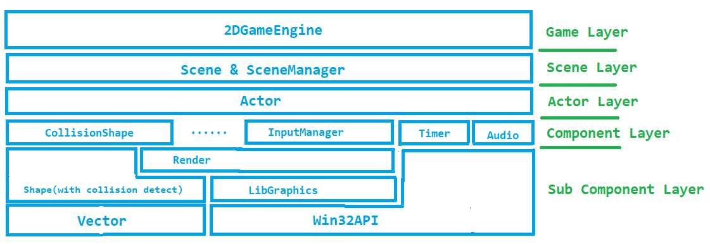
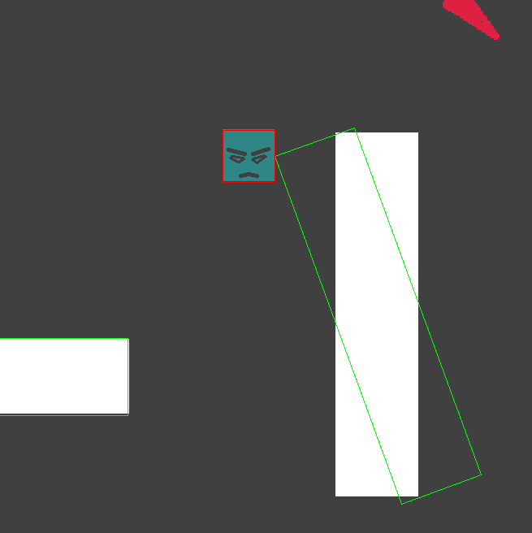
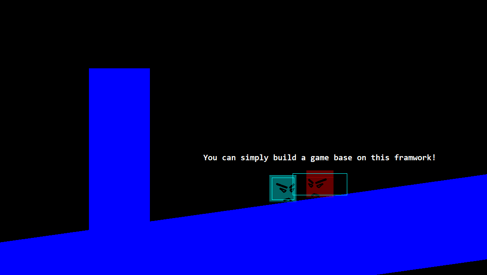
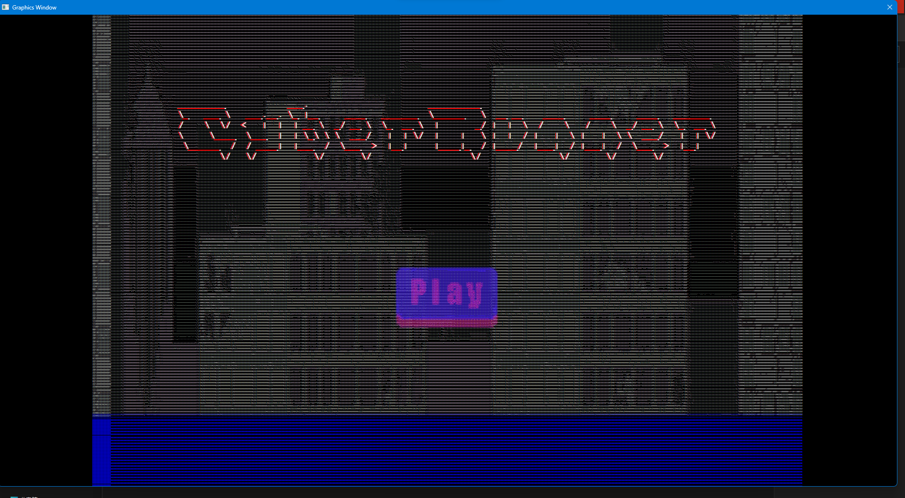

# ***A 2D Game Engine Based on LibGraphics***
## ***Part I :  Requirement***

 ### **1. 宗旨**: 
  能够让开发者忽略底层的实现，如形状渲染，碰撞检测和解算，资源管理，对象加载和卸载等，从而在高层次上关注游戏本身场景的构建和游戏内对象的更新逻辑，以达到降低游戏开发门槛，提高游戏开发效率的目的。

 ### **2. 需求规划**:
 - 面向对象的程序设计风格
 - 杜绝内存泄漏，绝对的内存安全
 - 相对完善的碰撞检测以及完全自定义的碰撞响应
 - 添加用户相机，画面显示的内容是相机视角内容
 - 可复写的对象更新逻辑和渲染方法，开发自由度较高
 - 开发者可控的场景管理，可以随时从内存中加载卸载场景，与场景间传参
 - 组件化的开发逻辑，提高开发效率
 - 支持自定义组件，框架具有扩展性

## ***Part II :  How We Realized It***

 ### **1. 面向对象的程序设计风格**
  如何在C语言中实现类似Cpp的面向对象程序设计风格的确是我们一开始的难题，C语言的结构体能够实现封装，但是多态和继承如何实现呢？
 - **继承**： 这就要说到C的结构体在内存中的分布了，假设定义如下结构体
 ```C
 struct A{
   int a;
   char b;
 }
 ```
 那么在A所在的内存其区域中，从A的首地址开始向后`sizeof(int)`的区域内就是成员变量`a`，从A的首地址向后偏移`sizeof(int)`向后`sizeof(char)`的区域内就是成员变量`b`。
 在此基础上考虑如下结构体定义：
 ```C
 typedef struct father{
   int a;
   int b;
 } father;

 typedef struct child{
   father super;
   int c;
 } child;
 ```
 在这样一个定义下，`child`可以被认为**继承自**父类`father`，因为child的内存分布首先是一块`super`，然后是属于`child`自己新产生的成员变量`c`。我们依然可以使用一个`father *ptr;`来指向一个`child`，并访问其父类中的内容，这就实现了符合定义的一种**继承**，下图有更加形象的说明：
 
 

 - **多态**： 在实现了继承的基础上如何实现类似Cpp中父类虚函数可以由子类覆盖实现从而达到不同的子类具有不同功能的**多态**效果呢？
 我们可以考虑给上文中定义的`father`结构体添加一个**虚函数表**，其定义如下
 ```C
 typedef struct VirtualFunctionTable{
   void (*virtualFunction)(int a, ...);
 } VirtualFunctionTable;
 
 typedef struct father{
   int a;
   int b;
   VirtualFunctionTable vptr;
 } father;

 typedef struct child{
   father super;
   int c;
 } child;
 ```
 这时候在创建子类的过程中我们可以通过修改其`super`中的`vptr`中的`virtualFunction`指向的函数实现子类对父类虚函数的覆盖实现。

 - **实际案例**： 下面我们将通过本项目中的一段代码展现本项目在**面向对象程序设计风格**上的具体实现
 ```C
 /* Shape.h的一部分*/
 #define EMPTY_SHAPE 0
 #define RECT 1
 #define CIRCLE 2

 extern double COLLISION_MERGEN;
 /*---------------------------Shape Type----------------------------*/
 typedef struct Shape {
	
	Vector pos;
	double angle;
	bool fill;
	char* color;
	double density;

	//顶点数组
	Vector** vertices;

	void (*setAngle)(struct Shape*, double);
	double (*getAngle)(struct Shape*);
	void (*setPos)(struct Shape*, Vector*);
	Vector* (*getPos)(struct Shape*);
	bool (*isCollideWith)(struct Shape*, struct Shape*);
	Vector* (*getCollisionVector)(struct Shape*, struct Shape*);

	struct shapevTable* vptr;
 } Shape;

 typedef struct shapevTable{
	void (*render)(struct Shape*);
	const int (*getShape)();
 } shapevTable;

 Shape* newShape(Vector *pos, double angle, bool fill, char* color, double density);
 void destoryShape(Shape* s);
 /*----------------------------Rect---------------------------------*/
 typedef struct Rect {
	Shape super;
	double width, height;
 } Rect;

 Rect* newRect(Vector *pos, double angle, double width, double height, bool fill, char* color, double density);
 void destoryRect(Rect* rt);
 /*-----------------------------Circle------------------------------*/
 typedef struct Circle {
	Shape super;
	double radius;
 } Circle;

 Circle* newCircle(Vector *pos, double angle, double radius, bool fill, char* color, double density);
 void destoryCircle(Circle* c);
 ```

 在这段代码中我们不难发现，`Rect`和`Circle`都**继承**自`Shape`这个父类。
  矩形和圆都需要渲染但是它们的渲染方式并不相同，我们通过覆写父类虚函数的方式实现**多态**，具体实现如下(注意在`initRect`和 `initCircle`中对`super`的`vptr`的操作)：
  ```C
 /*Shape.c的一部分*/
 static void initShape(Shape *shape, Vector pos, double angle, bool fill, char *color, double density)
 {
 //...
    //为vTable分配空间
	shape-vptr = (shapevTable *)calloc(1, sizeof(shapevTable));
 #if MEM_DEBUG
	MEM_BLOCK_NUM  ;
	printf("\nLOG:\n MEM_BLOCK_NUM: %d", MEM_BLOCK_NUM);
 #endif
    //设置为默认的父类虚函数
	shape-vptr-getShape = returnEmptyShape;
	shape-vptr-render = NULL;
 }
 //...
 static void initRect(Rect *rect, Vector pos, double angle, double width, double height, bool fill, char *color, double density)
 {
   //...
	if (rect-super.vptr == NULL)
	{
		printf("Cannot allocate memory for vptr of rect shape\n");
		return;
	}
    //在Rect初始化函数中设置vTable中的函数指针为Rect的实际函数
	rect-super.vptr-render = renderRect;
	rect-super.vptr-getShape = returnRectType;
	rect-super.vertices = (Vector **)calloc(4, sizeof(Vector *));
 }
//...

 static void initCircle(Circle *circle, Vector pos, double angle, double radius, bool fill, char *color, double density)
 {
   //...
    //在Rect初始化函数中设置vTable中的函数指针为Rect的实际函数
	circle-super.vptr-render = renderCircle;
	circle-super.vptr-getShape = returnCircleType;
	destoryShape(shapeptr);
	circle-radius = radius;
 }
 //...
 ```

 ### **2. 杜绝内存泄漏，绝对的内存安全**
  确保没有内存泄漏需要从两个角度下功夫：第一是确保每次分配内存都有对应的释放内存的操作，第二是能够通过某种手段监控内存块的分配与释放。
 - **分配释放对应**： 通过上文中的代码我们可以看到，每次分配内存都会有对应的释放内存的操作，每一个创建对象分配内存的`newXXX()`函数下方就有声明一个`destoryXXX()`函数用于销毁该对象，改销毁行为是**递归**的，即销毁自身时首先销毁自己的父类或自身含有的可以销毁的低层级对象。这个函数会在释放内存的时候被调用，从而确保每次分配内存都有对应的释放内存的操作。并且我们对整个`libgraphics`的运行框架进行了少量修改，使得程序退出时会执行`Free()`函数，递归的释放所有内存块，防止内存泄漏。
 ```C
 int WINAPI WinMain(HINSTANCE hThisInstance,
                   HINSTANCE hPrevInstance,
                   LPSTR lpszArgument,
                   int nFunsterStil)

 {
    MSG messages; /* Here messages to the application are saved */
    Main();
    g_looping = TRUE;
    /* New comments: Run the Game loop, g_looping will be false when process get the message WM_DESTORY*/
    while (g_looping)
    {
        while ( // GetMessage(&messages, NULL, 0, 0)
            PeekMessage(&messages, NULL, 0, 0, PM_REMOVE))
        {
            /* Translate virtual-key messages into character messages */
            TranslateMessage(&messages);
            /* Send message to WindowProcedure */
            DispatchMessage(&messages);
        }
        EngineUpdate((double)GAME_TIME_TICK);
        Render();
    }
    Free();             //该函数执行内存块的释放， 防止内存泄漏
    FreeConsole();
    return messages.wParam;
}
 ```

 - **内存分配与销毁监视**： 我们通过创建一个全局变量`MEM_BLOCK`统计内存块的个数，在每一句`calloc`下方执行`MEM_BLOCK++`，每一句`free`下方执行`MEM_BLOCK--`，最终程序结束后如果`MEM_BLOCK`回到`1`就可以说明没有内存块泄漏了。


 ### **3. 相对完善的碰撞检测以及完全自定义的碰撞响应**
 
 - **相对完善碰撞检测**： 要实现基于几何的碰撞检测而非基于网格的碰撞检测，我们需要用到一些图形学知识。在这里我们使用**AABB**配合**分离轴定理**实现碰撞检测和碰撞接触面的法向量求解。下图解释了如何使用AABB和SAT实现任意角度矩形碰撞检测的方法：

 
 - **完全自定义的碰撞响应**： 因为碰撞检测只返回碰撞与否，获取碰撞向量只返回碰撞法向量。开发者可以在编写游戏对象更新逻辑时通过调用这两个函数，在已知是否碰撞和碰撞法向量的基础上自己编写场景需要的碰撞响应方式。我们可以选择根据碰撞向量进行对应的物理行为模拟，也可以仅仅是作为一个进入某区域的检测，这在最后的demo截图中都有体现。

- 有关碰撞检测算法的相关代码可以参考 [shape.c](https://github.com/NiJingzhe/2DGameEngine_Based_On_LibGraphics/blob/master/src/2DGameEngine/Engine/shape.c) 中的`isCollideWith`函数和`getCollisionVector`函数，这里不再赘述。（如果这里的超链接无法点击可以看文末的仓库链接）

### **4. 添加用户相机，画面显示的内容是相机视角内容**

游戏中窗体显示的画面实际上大部分时候都不是整个场景，而是相机拍摄到的画面。所以我们在引擎中添加了相机这个概念。
- **相机功能的实现**： 相机结构体的定义如下：
```C
typedef struct Camera {
    Vector position;
    double zoom;
} Camera;
```
不难发现，实际上相机结构体内存储的内容就是一个**从世界坐标系到相机坐标系的变换**所需要的三个参数，因为镜头没有旋转所以只有平移变换和缩放变换。这个相机是全局的，于是我们只要在各种组件的`render`方法中考虑相机的位置和缩放参数来写渲染代码，就可以实现窗口上绘制的是相机拍摄到的区域这样的功能，本质上是给所有的对象都做一次**从世界坐标系到相机坐标系再到屏幕坐标系的变换**，具体例子如下：
```C
static void renderRect(Shape *s)
{

	SetEraseMode(FALSE);

	Rect *rect = (Rect *)s;

	Vector vertex[4] = {0};
	memcpy(&vertex[0], rect->super.vertices[0], sizeof(Vector));
	memcpy(&vertex[1], rect->super.vertices[1], sizeof(Vector));
	memcpy(&vertex[2], rect->super.vertices[2], sizeof(Vector));
	memcpy(&vertex[3], rect->super.vertices[3], sizeof(Vector));

	for (int i = 0; i < 4; ++i)
	{
    //求解矩形顶点在世界坐标系下的坐标
		vertex[i].rotate(&vertex[i], rect->super.angle);
		vertex[i].add(&vertex[i], &(rect->super.pos));
    
    //根据相机参量求解矩形顶点在相机坐标系下的坐标，并变换到屏幕坐标系
		vertex[i].x = (vertex[i].x - globalCamera.position.x) * globalCamera.zoom + getww / 2;
		vertex[i].y = (vertex[i].y - globalCamera.position.y) * globalCamera.zoom + getwh / 2;
	}

	SetPenColor(rect->super.color);
	SetPenSize(1);
	MovePen(vertex[0].x, vertex[0].y);
	if (rect->super.fill)
		fill(rect->super.density);

	DrawLine(vertex[1].x - vertex[0].x, vertex[1].y - vertex[0].y);
	DrawLine(vertex[2].x - vertex[1].x, vertex[2].y - vertex[1].y);
	DrawLine(vertex[3].x - vertex[2].x, vertex[3].y - vertex[2].y);
	DrawLine(vertex[0].x - vertex[3].x, vertex[0].y - vertex[3].y);

	if (rect->super.fill)
		endfill;
}
```

 ### **5. 可覆写的对象更新逻辑和渲染方法，开发自由度较高**
 前文已经提到过**继承**和**多态**，基于这两点我们在**演员**层级和**组件**层级都实现了更新逻辑和渲染逻辑的可覆写特性（*有关**演员**与**相关概念**的具体定义在第三部分会写的定义*）
 - **组件层级的覆写**： 所有的组件都继承自`Component`这个基类，该基类定义中包含一个虚函数表，其中有`render`和`update`两个函数指针，可以在其派生的子类中进行覆写。实际上由于我们使用函数指针实现多态，该虚函数表中的函数指针也可以在创建子类之外的部分被修改，比如在某些更新逻辑下修改某个组建的的`render`方法实现特定条件触发的简单特效等。
 ```C
//Component.h中部分和Component基类定义相关代码
typedef struct Component
{
	struct componentvTable *vptr;
	char *meta;
	struct Component *next, *prev;

	char *(*getMeta)(struct Component *);
	void (*setMeta)(struct Component *, char *meta);

} Component, *ComponentNode;

typedef void (*ComponentRender)(struct Component *);
typedef void (*ComponentUpdate)(struct Component *, ...);

typedef struct componentvTable
{
	ComponentRender render;
	ComponentUpdate update;
	const int (*getComponentType)();
} componentvTable;
 ```

 - **演员层级的覆写**：通过类似的方法，**演员**本身就是一个基类型，可以做出下一级的派生，但是一般情况下只要通过添加组件这种 **组合** 开发逻辑就可以满足大部分的需求。我们也是通过覆写其虚函数表中的函数指针实现多态的。其定义如下：
 ```C
//actor.h中和演员定义相关的代码
typedef struct Actor {

	ComponentNode componentList;

	Vector pos, vel;
	char* meta;
	struct actorvTable* vptr;  //虚函数表

	struct Actor* prev, * next;

	void (*setVel)(struct Actor*, Vector*);
	Vector* (*getVel)(struct Actor*);
	void (*setPos)(struct Actor*, Vector*);
	Vector* (*getPos)(struct Actor*);
	char* (*getMeta)(struct Actor*);
	void (*setMeta)(struct Actor*, char* meta);
	void (*addComponent)(struct Actor*, Component*);
	void (*delComponent)(struct Actor*, char* meta);
	ComponentNode (*getComponent)(struct Actor*, char* meta);

	Vector* (*getCollisionVector)(struct Actor*, struct Actor*);
	bool (*isCollideWithActor)(struct Actor*, struct Actor*);
	
} Actor, *ActorNode;
//虚函数表的具体定义，可以看到这里有一个update方法和一个render方法，他们都是可以被覆写的
typedef struct actorvTable {
	void (*update)(struct Actor*, double);
	void (*render)(struct Actor*);
	const int (*getActor)();
} actorvTable;
 ```

 ### **6. 开发者可控的场景管理，可以随时从内存中加载卸载场景，与场景间传参**
 这个功能实际上在一个简陋的大作业中实在是可有可无，毕竟不是一个大型游戏的话对场景的预加载和卸载什么的并不能在内存和时间上有明显的改善。但还是抱着尝试的心态做了一下，主要是为了实现场景间传参，实现场景复用，顺便就把场景的加载和卸载给做了。
 - **场景切换加载卸载**： 要实现这个功能首先得说明我们的场景管理架构，我们构建了一个相对完善的`ScenesManager`，其定义如下：
 ```C
 typedef struct ScenesManager{
    SceneNode currentScene;
    SceneNode lastScene;
    SceneNode scenesList;   //看好了这里有链表！！！！！！
    char* target;
    bool unloadCur, setupNext;

    void* param;

    SceneNode (*getScene)(char*);
    void (*switchTo)(char*, bool, bool, void*, size_t);
    void (*checkSwitch)();
    void (*loadScene)(SceneNode*, CreateSceneFunction, void*);
    void (*unloadScene)(char* target);
} ScenesManager;
 ```
可以看见，所有的场景其实都存储在一个`scenesList`的**链表**中，除此之外场景管理器有一个场景节点成员`currentScenes`指向**当前场景**，引擎只会执行`currentScenes`的更新逻辑和渲染逻辑，所以通过改变`currentScenes`就可以实现场景的切换。但是考虑场景的加载和卸载，就要做更多的操作。

其中`switchTo`函数接受的四个参数分别表示：**目标场景**、**是否销毁当前场景**、**是否要初始化目标场景**、**参数对象**、**参数size**。这个函数的具体实现如下：
 ```C
static void switchTo(char *target, bool unloadCur, bool setupNext, void *param, size_t size)
{

    if (target == NULL ││ scenesManager.getScene(target) == NULL)
    {
        scenesManager.target = NULL;
        return;
    }
    else
    {
        scenesManager.target = target;
    }

    if (size  0 && param != NULL)
    {
        void *new_param = malloc(size);
#if MEM_DEBUG
        MEM_BLOCK_NUM++;
        printf("\nLOG:\n MEM_BLOCK_NUM: %d", MEM_BLOCK_NUM);
#endif
        memcpy(new_param, param, size);
        if (scenesManager.param != NULL)
        {
            free(scenesManager.param);
#if MEM_DEBUG
            MEM_BLOCK_NUM--;
            printf("\nLOG:\n MEM_BLOCK_NUM: %d", MEM_BLOCK_NUM);
#endif
        }
        scenesManager.param = new_param;
    }
    else
    {
        if (scenesManager.param != NULL)
        {
            free(scenesManager.param);
#if MEM_DEBUG
            MEM_BLOCK_NUM--;
            printf("\nLOG:\n MEM_BLOCK_NUM: %d", MEM_BLOCK_NUM);
#endif
      }
        scenesManager.param = NULL;
    }

    scenesManager.unloadCur = unloadCur;
    scenesManager.setupNext = setupNext;
}
 ```
 不难发现，该函数首先根据**目标场景**设定场景管理器的`target`属性，然后根据**参数size**设置场景管理器的`param`属性，最后存储`unloadCur`和`setupNext`两个选项状态。
 在某个场景中某个游戏对象调用`switchTo`后，切换相关的信息都会被暂存在`ScenesManager`结构体中，在下一轮的引擎更新流程中`ScenesManager`会通过`checkSwitch`检查相关成员变量的状态以决定如何执行场景跳转。该函数具体实现如下:
 ```C
 static void checkSwitch()
{
    if (scenesManager.target == NULL)
        return;

    if (scenesManager.unloadCur)
    {

        if (scenesManager.currentScene->prev != NULL)
        {
            scenesManager.currentScene->prev->next = scenesManager.currentScene->next;
        }
        else
        {
            scenesManager.scenesList = scenesManager.currentScene->next;
        }
        if (scenesManager.currentScene->next != NULL)
        {
            scenesManager.currentScene->next->prev = scenesManager.currentScene->prev;
        }
        scenesManager.currentScene->exit(scenesManager.currentScene);
        scenesManager.currentScene = NULL;
        scenesManager.lastScene = NULL;
    }
    else
    {
        scenesManager.lastScene = scenesManager.currentScene;
    }

#if MEM_DEBUG
    printf("\nLOG:\nSuccessfully unloaded last scene!\n");
#endif

    scenesManager.currentScene = scenesManager.getScene(scenesManager.target);
    scenesManager.target = NULL;
#if MEM_DEBUG
    printf("\nLOG:\nAfter getScene, now current scene is: %p, and meta is: %s\n", scenesManager.currentScene, scenesManager.currentScene->meta);
#endif
    if (scenesManager.setupNext)
        scenesManager.currentScene->setup(scenesManager.currentScene, scenesManager.param);
}
 ```
 可见，在`checkSwitch`函数中，根据**加载卸载选项**和**初始化选项**的不同执行了不同的动作。对于需要卸载场景的情况，会执行当前场景的`exit`方法，实际上`exit`方法中正是调用了场景的**析构函数**，即`destoryScene`来实现将当前场景从内存中卸载。

 有关于场景加载的内容，场景本身具有两个关键函数，一个是用于**创建场景，申请场景内存**的`createScene`函数，另一个是**初始化场景本身或场景内对象**的`setupScene`函数。执行`createScene`可以把这个场景加载到内存中，执行`setupScene`就可以初始化场景。可以考虑一种实际情况，例如*从游戏界面切换到暂停界面*，在这个案例中游戏界面不需要卸载，暂停界面需要加载和初始化。而其逆过程*从暂停界面切换回游戏界面*，为了节约内存，我们选择将暂停界面从内存中卸载，但是由于游戏界面一直存在于内存中，我们不需要创建，所以在切换场景前**必须判断改场景是否在内存中**来确定是否要执行场景加载，例如下面的代码段：
 ```C
//scene2中暂停按钮更新逻辑中的一部分
if (scmng.getScene("scene1") == NULL)
    scmng.loadScene(&scene1, createScene1, "from pause");
scmng.switchTo("scene1", FALSE, TRUE, "from pause", strlen("from pause") * sizeof(char));
 ```
 - **场景间传参**：参数传递实际上非常简单，在我们的设计中，场景加载到内存的过程是确定的，参数只影响该场景的初始化方案。所以每个场景的`setupScene`函数接受一个`void *param`参数，根据这个参数，执行相应的初始化流程。而这个参数是在`ScenesManager`的`checkSwitch`过程中传递给目标场景的`setupScene`的。具体案例承接上文`scene2暂停按钮`，我们看`scene1`中的`setupScene`函数：
```C
void setupScene_scene1(SceneNode scene1, void *param)
{
    //根据传入的param做出相应的响应
    if (param != NULL)
    {
        if (strcmp(param, "from pause") == 0)
        {
            fromPause = TRUE;
        }
        else
        {
            fromPause = FALSE;
        }
    }
    else
    {
        fromPause = FALSE;
    }
    scene1BackgroundShape->enable = FALSE;
    scene1BackgroundShape->visible = TRUE;
    scene1BackgroundShape->setMeta((ComponentNode)scene1BackgroundShape, "scene1BackgroundShape");

    //每个游戏内对象的初始化也是根据param产生差异的
    setupBackgroundPic(param);
    setupStartupTitle(param);
    setupScene1BGM(param);
}
```
实现**场景间传参**的主要目的是为了**提高场景的复用率**，例如一个*双人游戏的解算界面*，无论哪一方胜利，显示的格式都是一致的，但是同一个纹理需要调用的资源可能不同，这时候我们不需要写两个场景，可以通过只编写一个场景，根据传入参数的不同加载不同的纹理资源实现同一个场景的复用。

### **7. 组件化的开发逻辑，提高开发效率**
有关于什么是组件化的开发逻辑以及为什么要使用组件化的开发逻辑，有如下解释：**继承层次过深、继承关系过于复杂时会影响到代码的可读性和可维护性**，于是产生了实**多态**的另一种方法：**组合** 。

在很多场景下，组合实现的多态往往比继承更加灵活快捷，同时更加易于维护，所以像**Unreal**和**Unity3D**等主流引擎都采用了组件组合的方式实现游戏实体的功能多态，更有**Godot**这一类更加激进的引擎将整个场景和游戏内对象归结为一棵树，每一个节点提供功能可以供其父节点使用。

这些案例充分说明了在游戏开发领域，**组合**在高层次上往往是比**继承**更加优秀的实现**多态**的方式。

- **组件化开发逻辑的实现**： 在我们的设计中，每一个游戏内对象都是一个`Actor`，每一个`Actor`都可以添加多个`Component`，这些`Component`可以是`CollisionShape`、`charTexture`、`uiText`、`Timer`等等，这些**组件**都是`Component`的子类，都可以通过`Actor`的`addComponent`方法添加到`Actor`中，这样就实现了**组件化**的开发逻辑。具体实现如下：
```C
typedef struct Actor {

	ComponentNode componentList; //这里是一个链表，可以添加多个组件

	Vector pos, vel;
	char* meta;
	struct actorvTable* vptr;

    //...省略无关代码

} Actor, *ActorNode;
```
不难发现，`Actor`中的`componentList`是一个链表，可以添加多个组件。实际上`Actor`更新逻辑和渲染逻辑就是递归的执行每个组件的更新逻辑和渲染逻辑：
```C
static void renderActor(Actor *actor)
{
  //遍历链表，执行每个组件的渲染逻辑
	ComponentNode currentComp = actor->componentList;
	while (currentComp && currentComp->vptr != NULL && currentComp->vptr->render != 0)
	{
		currentComp->vptr->render(currentComp);
		currentComp = currentComp->next;
	}
}
//默认的更新逻辑是Do Nothing，开发者根据需要覆写该函数
void updateActor(Actor *actor, double delta)
{	
	return;
}
```
在这样的基础上，我们只要给不同的`Actor`添加不同的组件，就能够实现不同的功能。
  

### **8. 支持自定义组件，框架具有扩展性**
在上文中我们已经提到了`Component`这个基类，所有的组件都继承自这个基类，所以实际上开发者自己也可以通过这个基类写一些派生类，从而实现自定义组件。

由此可见，这个框架并不是静态的，开发者可以根据自己的需求在组件层面上进行扩展，从而实现更多的功能。

## ***Part III :  Structure Of This Engine***
*为什么第三部分不是功能亮点？因为第二章说的功能全是亮点*

### **1. 架构图**


### **2. 相关概念**
- **场景**：游戏中的一个场景，可以理解为一个舞台

- **演员**：场景中的任何实体都被称作**演员**

- **组件**：不同**演员**需要具备不同的功能，有的可以检测碰撞，有的可以计时，有的可以显示UI，有的则负责被玩家控制，这些功能都是通过向**演员**添加各种**组件**来实现的

- **亚组件对象**：组件本身可能也是由一些提供功能和算法的对象组成的，这些对象被称作**亚组件对象**，任何**亚组件对象**都必须在创建并完成组件的构成或执行相应的计算功能后**立刻销毁**，否则会导致内存泄漏

- **当前场景**：本游戏引擎的窗口在同一时刻只能渲染一个**场景**，也只能同时对一个**场景**进行逻辑处理，这个**场景**就是**当前场景**

### **3. 相关文件说明**
```bash
2DGameEngine
    ├─ config.h                      #配置文件，是否开启debug等配置
    ├─ Engine
    │   ├─ 2DEngine.c                #游戏全局数值，例如时间步长
    │   ├─ 2DEngine.h                #游戏引擎导出头文件
    │   ├─ actor.c                   #演员相关函数，增删查组件、默认的更新和渲染逻辑等
    │   ├─ actor.h                   #演员相关定义
    │   ├─ camera.c                  #摄像机相关函数、更改摄像机位置和缩放参数等方法
    │   ├─ camera.h                  #摄像机相关定义
    │   ├─ component.h               #组件的继承导出头文件
    │   ├─ components                #每个组件在.c文件中都实现了对应的默认渲染逻辑
    │   │      ├─ audio.c            #音频组件
    │   │      ├─ audio.h
    │   │      ├─ base_component.c   #组件基类
    │   │      ├─ base_component.h   
    │   │      ├─ chartexture.c      #字符纹理组件
    │   │      ├─ chartexture.h      
    │   │      ├─ collision_shape.c  #碰撞形状组件
    │   │      ├─ collision_shape.h
    │   │      ├─ picTexture.c       #图片纹理组件
    │   │      ├─ picTexture.h
    │   │      ├─ timer.c            #计时器组件
    │   │      ├─ timer.h
    │   │      ├─ uitext.c           #ui文字组件
    │   │      └─ uitext.h
    │   ├─ input_manager.c           #输入管理器
    │   ├─ input_manager.h           
    │   ├─ public_headers.c          #游戏引擎内部公共定义和头文件
    │   ├─ public_headers.h
    │   ├─ scene.c                   #场景相关函数
    │   ├─ scene.h                   #场景相关定义
    │   ├─ scenes_manager.c          #场景管理器
    │   ├─ scenes_manager.h
    │   ├─ shape.c                   #亚组件对象：形状
    │   ├─ shape.h                   #其中包含图形学的碰撞检测算法和基础图形的渲染方法
    │   ├─ vector.c                  #向量运算库
    │   └─ vector.h                  #向量相关定义
    └─ libgraphics                   #以下是libgraphics库文件
            ├─ exceptio.c
            ├─ exception.h
            ├─ extgraph.h
            ├─ gcalloc.h
            ├─ genlib.c
            ├─ genlib.h
            ├─ graphics.c
            ├─ graphics.h
            ├─ random.c
            ├─ random.h
            ├─ simpio.c
            ├─ simpio.h
            ├─ strlib.c
            ├─ strlib.h
            └─ tags
```

### **4. 框架流程**
- **第一步**：`Main`函数执行初始化流程，初始化图形窗口，并根据`game_conf.h`中的设置创建第一个场景并将其载入内存，场景管理器将会把这个场景首先设定为**当前场景**

- **第二步**：程序本体开始进入游戏循环，首先判断事件队列是否为空，不为空则进行事件处理和分发，之后游戏引擎进入`EngineUpdate`函数，对**当前场景**执行更新逻辑，负责更新**场景**内每个**演员**的位置等相关属性，其中**演员**的具体更新逻辑默认是do nothing的，开发者可以根据需要自己重写相关**演员**的**更新函数**

- **第三步**：游戏引擎进入`Render`函数，对**当前场景**进行渲染，渲染的顺序由向**场景**内添加**演员**的顺序决定，**先添加的先渲染，先渲染的会被后渲染的遮挡**。其中**演员**的具体渲染逻辑默认是渲染自身每一个需要渲染的**组件**，开发者可以根据需要自己重写相关**演员**的**渲染函数**

*之后重复以上**第二步**和**第三步**，直到**窗体被关闭***

- **第四步**：若窗体被关闭，引擎进入`Free`函数，开销毁对象释放内存。从销毁**场景**开始，递归的销毁每个场景内的**演员**与它们的**组件**，直到所有**场景**完成销毁，程序退出。
  
- **以下是包含了引擎主要函数实现的`game.c`文件中的代码**：
```C
#include "2DEngine.h"
#include "scene_info.h"
#include "game_conf.h"

void Main()
{
    InitGraphics();            //初始化绘图窗口
#if ENGINE_DEBUG
    InitConsole();             //debug模式下也要打开控制台
#endif
#if ENGINE_DEBUG
    LOG("Enter Game Init--------------------------------------------------------------------------------------------------------------------------");
#endif
    srand(time(0));            //初始化随机种子
    initInputManager();        //初始化输入管理器
    initScenesManager();       //初始化场景管理器
    initCamera(getww/2, getwh/2, 1);     //初始化相机
    //载入game_conf.h中配置的启动场景
    scmng.loadScene(&STARTUP_SCENE, STARTUP_SCENE_CREATOR, NULL);
    scmng.currentScene = STARTUP_SCENE;
    //初始化启动场景
    scmng.currentScene->setup(scmng.currentScene, NULL);
#if ENGINE_DEBUG
    LOG("Game init finished!----------------------------------------------------------------------------------------------------------------------");
#endif
}

//所有的计时器回调处理
void CALLBACK TimerCallBack(HWND a, UINT b, UINT_PTR id, DWORD d)
{
    if (switchTimer != NULL && id == switchTimer->id)
    {
        switchTimer->callBackFunction();
    }
    if (timer != NULL && id == timer->id)
    {
        timer->callBackFunction();
    }
    if (freezSkillTimer != NULL && id == freezSkillTimer->id){
        freezSkillTimer->callBackFunction();
    }
}

//引擎更新过程
void EngineUpdate(double delta)
{
    //首先检查是否有场景跳转，有则执行
    scmng.checkSwitch();
    //执行当前场景的更新逻辑，实际上是递归访问场景内每个Actor的更新逻辑
    scmng.currentScene->update(scmng.currentScene, delta);
    //事件更新重置
    clearEvent();
}

//引擎渲染过程
void Render()
{
    //执行当前场景的渲染逻辑，实际上是递归访问场景内每个Actor的渲染逻辑
    scmng.currentScene->render(scmng.currentScene);
}

//引擎释放内存过程
void Free()
{
#if ENGINE_DEBUG
    LOG("Enter Free-------------------------------------------------------------------------------------------------------------------------------");
#endif
    //执行场景管理器的的销毁逻辑，实际上是递归访问场景列表内场景内每个Actor的销毁逻辑
    //最终销毁所有的场景
    destroyScenesManager();
#if ENGINE_DEBUG
    LOG("Finish Free------------------------------------------------------------------------------------------------------------------------------");
#endif
}

```


## ***Part IV :  Quick Start***
### **1. 游戏项目结构**
```bash
src
│
│---2DGameEngine              #引擎库（也就是我们的大作业项目）
│
│---YourGameFolder            #你的项目
    │ 
    │---game_conf.h           #对启动场景的设置
    │
    │---game.c                #游戏主体逻辑，与定时器回调函数
    │
    │---scene_info.h          #场景信息
    │
    │---scene1                #场景1文件夹
    │    │
    │    │---scene1.h         #场景1的public属性
    │    │ 
    │    │---scene1.c         #场景1的创建和初始化函数
    │    │
    │    │---scene1_Actor1.h  #场景1的第一个演员的public属性
    │    │
    │    │---scene1_Actor1.c  #场景1的第一个演员的创建和初始化函数
    │     ...
    │
    │---scene2
    │    │
    │    │---scene2.h
    │    │
    │    │---scene2.c
    │    │
    │    │---scene2_Actor1.h
    │    │
    │    │---scene2_Actor1.c
    │     ...
    │
    │ ...
```

### **2. 开发者要做什么？**
- **第一步**：在`game_conf.h`中设置游戏的启动场景

- **第二步**：根据`demo`创建`game.c`

- **第三步**：根据`demo`创建`scene_info.h`

- **第四步**： 创建一个场景文件夹，并在其中创建对应的`scene.h`和`scene.c`，并将其包含到`scene_info.h`中

- **第五步**：在`scene.c`中实现`sceneCreate`函数，创建**场景**内的**演员**，并将其添加到场景中

- **第六步**：在`scene.h`中实现`setupScene`函数，该函数接受一个参数`param`来自**场景**间传参， 可以在该函数内更具`param`初始化**场景**本身的属性和其内的**演员**，该初始化过程包括指定相关**演员**的**更新函数**和**渲染函数**，对**演员**的创建和初始化需要调用封装与**演员**相关文件内的函数实现。

- **第七步**：创建相关演员的`.h`与`.c`完成对**演员**自身属性，**组件**，创建函数与初始化函数的定义与封装，并实现相关的**更新函数**和**渲染函数**

## ***Part V :  Demo Screenshots***
- **1. 碰撞检测**

展现了任意角度矩形的碰撞检测（绿色是墙体，现在小人不能再向右移动了）


- **2. 文字UI组件（我是说倒计时）**


- **3. 相机**

这是1.0的相机倍率下绘图
> 

这是0.5的相机下同样的场景的呈现
> 


- **4. 自定义碰撞响应的应用：检测碰撞后才能触发对话**



- **5. 通过覆写Actor更新函数实现的游戏AI（红色方块会追着你跑！）（实际上这也是基于相机实现了无限地图，类似黎明前二十分钟）**


- **5. 任意规模字符画的加载，为你的游戏增强表现力**


- **6. 快速便捷的游戏开发**

使用我们的引擎可以快速构建一个场景，下面是仅仅使用100+行代码实现有背景图动效，有字符纹理动效，能够响应键盘事件，有定时器，有背景音乐播放的开始界面的例子（就是上面用于说明相机功能的那个场景）。其中有很多重复性的代码，在Copilot等工具的加持下可以在3分钟内完成这个场景的构建。


- 还有一些别的特性无法通过截图展示，比如**场景间传参**，**场景复用**，**场景加载卸载**，**组件化开发逻辑**等等，可以在代码中找到相关的实现。

### ***附录A :  小组成员贡献***
- 倪旌哲： 完成游戏引擎基本框架的开发，完成两个表现引擎能力的demo的开发 (45%)
- 庞笑义：参与表现引擎能力的demo开发，完成demo的开始界面与解算界面。    (29%)
- 何婕：参与引擎部分组件的开发，参与demo开发，完成游戏界面的设计和开发  (26%)

### ***附录B :  全部代码***
由于代码过多(4300+ lines)，在这里只放上仓库链接
[仓库地址](https://github.com/NiJingzhe/2DGameEngine_Based_On_LibGraphics)：https://github.com/NiJingzhe/2DGameEngine_Based_On_LibGraphics
（[前面的访问不到的话可以试试这个](https://gitee.com/ni-jingzhe/2-dgame-engine-based-on-lib-graphics)：https://gitee.com/ni-jingzhe/2-dgame-engine-based-on-lib-graphics）